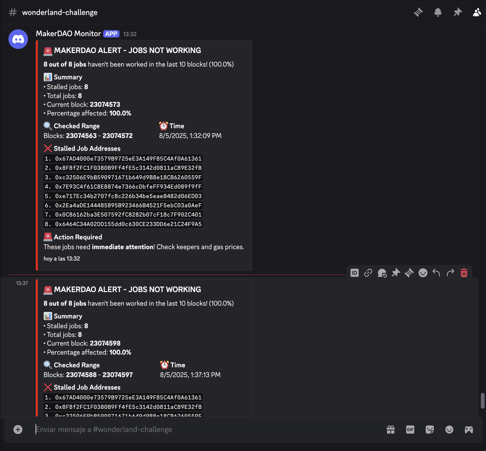

# MakerDAO Job Monitor

A serverless monitoring system for MakerDAO jobs that alerts via Discord when jobs haven't been executed recently.

## 🎯 What it does

This system monitors MakerDAO jobs by:
- Checking if jobs have executed `work()` calls in recent blocks
- Identifying stalled jobs that haven't been worked
- Sending real-time alerts to Discord
- Providing detailed monitoring reports

## 🚀 Quick Start

### Prerequisites
- Node.js 18+
- AWS CLI configured
- Serverless Framework
- Discord webhook URL

### Installation
```bash
npm install
```

- Add the .env:
```shell
cp .env.example .env
```
**Note**: Add your own Discord webhook in the `DISCORD_WEBHOOK_URL` field.

- Build the project

```shell
npm run build
```

- Run the project in local (one-shot):
```
npm run start
```

- Run the project using `serverless offline` with AWS Lambda:
```shell
npx serverless offline
```

**Note**: It will start sending an alert every 5 minutes, which will look something like this:


## 🏗️ Architecture
```shell
┌─────────────────┐    ┌──────────────────┐    ┌─────────────────┐
│   Lambda Cron   │───▶│   Job Monitor    │───▶│   Discord Bot   │
│   (Scheduler)   │    │   Service        │    │   (Alerts)      │
└─────────────────┘    └──────────────────┘    └─────────────────┘
                                │
                                ▼
                       ┌──────────────────┐
                       │   Ethereum RPC   │
                       │   (Web3 Data)    │
                       └──────────────────┘
```

## 🔧 Development
**Running Tests**
- To execute unit tests run this command:
```bash
npm run test:unit
```

- To execute integration test run this command:
```bash
npm run test:integration
```

## 📊 Performance Optimizations

- RPC Call Reduction: Uses event logs instead of full block scanning
- Intelligent Caching: LRU cache for blocks and job statuses
- Parallel Processing: Batch processing of multiple jobs
- Fallback Strategy: Graceful degradation when RPC is slow

## 🚨 Monitoring & Alerts
**Alert Types**

- 🚨 Critical: Stalled jobs detected
- ✅ Healthy: All jobs working normally
- 🔥 Error: System errors and failures

**Metrics Tracked**
- Job execution frequency
- RPC response times
- System error rates
- Alert delivery success

## 📖 API Documentation
**JobMonitorService**
```ts
class JobMonitorService {
  async checkJobsEfficiently(
    jobAddresses: string[],
    fromBlock: number,
    toBlock: number
  ): Promise<JobStatus[]>
}
```

**Configuration Options**
- `BLOCKS_TO_CHECK`: 10 -> Number of recent blocks to scan
- `BATCH_SIZE`: 10 -> Jobs processed in parallel
- `CACHE_TTL_MINUTES`: 5 -> Cache expiration time

## 🤝 Contributing

- i) Fork the repository
- ii) Create a feature branch
- iii) Add tests for new functionality
- iv) Ensure all tests pass
- v) Submit a pull request

## 📝 License

This project is licensed under the MIT License. See the [LICENSE](LICENSE) file for details.

---

**⭐ If this template is useful to you, consider giving the repository a star!**

---

**Made with ❤️ by Luis Lucena**